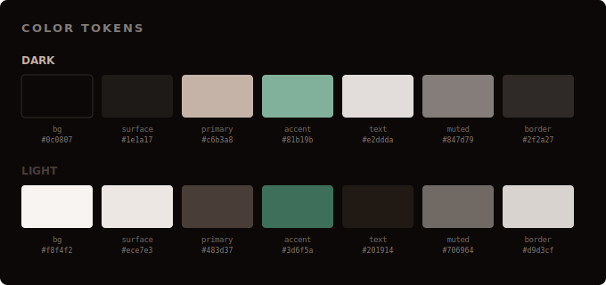
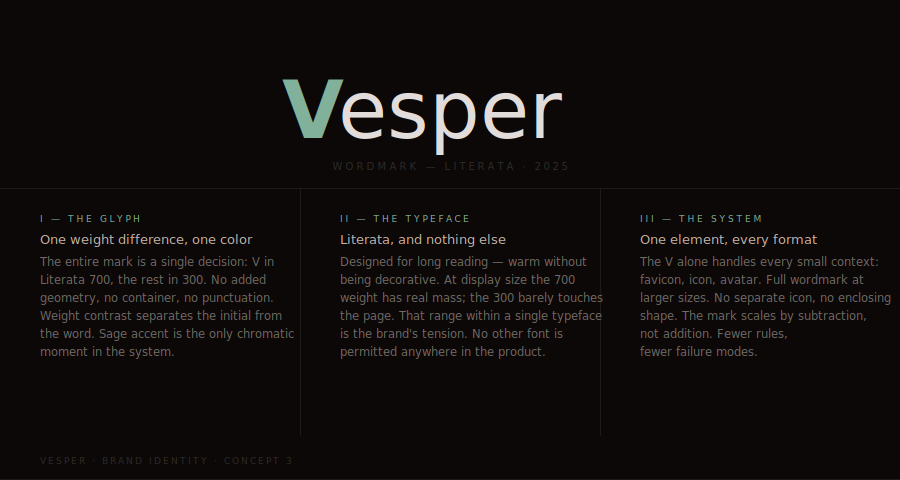

<p align="center">
  
</p>

<p align="center">
  
  
  
  
  
</p>

**Free. Open source. For everyone.**

Everyone goes through hard seasons — sleepless nights, anxiety that won't quiet down, grief that has no words, mornings where getting up feels impossible. Vesper exists because tools for healing shouldn't be locked behind a subscription, a paywall, or an app store. They should be free, they should work on any device, and they should be honest about what they're built on.

Vesper is a quiet place to rest — in Scripture, in prayer, and in your own breath. It brings together 2,000 years of Christian contemplative tradition — Lectio Divina, the Ignatian Examen, centering prayer, breath prayer, the Desert Fathers — with what modern neuroscience has learned about how the mind and body heal. Not to replace one with the other, but because they've always been saying the same thing.

The sessions are shaped by 9 AI expert agents — a Christian theologian, a clinical sleep psychologist, a contemplative prayer specialist, a meditation teacher, an ACT/CFT therapist, a motivational psychology researcher, a morning routine coach, a mindfulness teacher, and a professional narrator. The scripts are AI-generated, the voices are AI-narrated, the music is AI-composed. The entire pipeline — from ideation to final audio — is AI-driven, fully documented, and open source.

No server. No database. No accounts. No tracking. No paywall. Just static files that run anywhere.

Peace be with you.

### The science

Every session is grounded in peer-reviewed research. Techniques include:

- **Progressive Muscle Relaxation** — clinically shown to reduce cortisol and sleep onset latency ([Jacobson; meta-analysis](https://pubmed.ncbi.nlm.nih.gov/38322293/))
- **Yoga Nidra body rotation** — increases heart rate variability and delta brainwave activity ([PubMed](https://pubmed.ncbi.nlm.nih.gov/22866996/))
- **Autogenic Training** (Schultz method) — validated for chronic insomnia since 1932 ([review](https://pubmed.ncbi.nlm.nih.gov/7811786/))
- **Cognitive Behavioral Therapy for Insomnia (CBT-I)** — gold standard for sleep disorders ([autogenic + CBT-I](https://pubmed.ncbi.nlm.nih.gov/21787446/))
- **Acceptance and Commitment Therapy (ACT)** — cognitive defusion reduces emotional reactivity ([Hayes et al., 2006](https://pubmed.ncbi.nlm.nih.gov/16300724/))
- **Compassion-Focused Therapy (CFT)** — Kristin Neff's three-component self-compassion model ([Neff & Germer, 2013](https://pubmed.ncbi.nlm.nih.gov/23070875/))
- **RAIN framework** (Recognize, Allow, Investigate, Nurture) — reduces amygdala reactivity ([mindfulness & amygdala](https://pubmed.ncbi.nlm.nih.gov/29990584/))
- **Physiological Sigh** — Stanford 2023: the single most effective real-time breathwork for stress reduction ([Balban, Huberman et al.](https://doi.org/10.1016/j.xcrm.2022.100895))
- **Box Breathing** (4-4-4-4) — used by Navy SEALs, stabilizes HRV within 90 seconds ([systematic review](https://pubmed.ncbi.nlm.nih.gov/35623448/))
- **Coherent Breathing** (5.5 breaths/min) — maximizes heart rate variability and baroreflex sensitivity ([Lehrer et al., 2003](https://pubmed.ncbi.nlm.nih.gov/14508023/))
- **Non-Sleep Deep Rest (NSDR)** — Huberman Lab: boosts dopamine by 65%, equivalent to 2-3 hours of recovery ([Kjaer et al., 2002](https://pubmed.ncbi.nlm.nih.gov/11958969/))
- **Loving-Kindness (Metta) meditation** — increases vagal tone and positive affect ([Fredrickson et al., 2008](https://pubmed.ncbi.nlm.nih.gov/18954193/))
- **Gratitude practice** — reduces pre-sleep worry, improves sleep quality by 25% ([Wood et al., 2009](https://pubmed.ncbi.nlm.nih.gov/19073292/))
- **Forgiveness meditation** — reduces hostility-linked insomnia and nocturnal cortisol ([Lawler-Row, 2010](https://pubmed.ncbi.nlm.nih.gov/18787939/))
- **Repetitive prayer** (rosary/mantra) — synchronizes cardiovascular rhythms ([Bernardi et al., 2001](https://pubmed.ncbi.nlm.nih.gov/11751348/))

Every meditation includes a direct link to its source study on PubMed.

### The AI pipeline

Every meditation script is AI-generated, then reviewed by a panel of 9 AI expert agents — Christian theologian, clinical sleep psychologist, contemplative prayer specialist, meditation teacher, ACT/CFT therapist, motivational psychology researcher, morning routine coach, mindfulness teacher, and professional narrator/voice director — before being narrated by ElevenLabs AI voices. The ambient music is AI-composed (Suno), then processed through a custom therapeutic audio mixer to target specific brainwave states. No human wrote these scripts. No human recorded these voices. No human composed this music. The entire pipeline — from ideation to final audio — is AI-driven and fully documented.

### The result

Guided meditations for sleep, morning routines, anxiety, grief, self-compassion, and emergency SOS protocols. Therapeutic ambient music tuned for alpha, theta, and delta brainwave states. A liturgical Bible reader that follows the Church calendar. All narrated by AI voices, and served as a fully static web app that runs anywhere with zero infrastructure.

No server. No database. No accounts. No tracking. Just open-source code and static files.

---

## Features

- **Bible reader** — KJV + Louis Segond 1910 (FR) with liturgical daily readings (Revised Common Lectionary)
- **48 guided meditations** — sleep, morning, anxiety, contemplative prayer, self-compassion, SOS, prayers
- **Audio player with synchronized text highlighting** — ElevenLabs narration with character-level alignment
- **Two narrator voices** — Katherine (default) and James, with full French narration (100% TTS coverage)
- **Liturgical Today page** — rich daily context with origin, theology, French traditions, Scripture references, and practical guidance for every feast, season, and holy day
- **5 breathing exercises** — Box Breathing, 4-7-8, Deep Calm, Energizing, Sleep Preparation
- **SOS emergency protocols** — panic attack, anxiety reset, anger cooldown, NSDR (Non-Sleep Deep Rest)
- **Bible text-to-speech** — Kokoro.js (82M ONNX, desktop) or native Speech Synthesis (mobile), verse-by-verse highlighting
- **5 ambient music tracks** — therapeutic processing (brown noise, binaural beats, sub-bass)
- **Full-text Bible search** — FlexSearch index across 31,102 verses
- **iOS 26 liquid glass UI** — progressive blur navbar, floating frosted tab bar, safe area compliance (Dynamic Island, notch, home indicator)
- **Light / Dark / Auto theme** — auto switches at 8 PM, forced dark for sleep routes
- **Fully bilingual** — English and French across all content, UI, and audio — locale persists and syncs across tabs
- **PWA installable** — offline-capable, Media Session API for lock screen controls
- **Fully static** — no server, no database, no authentication required

---

## Stack

| Layer | Tech |
|-------|------|
| Framework | [Astro 5](https://astro.build/) — static site generator |
| UI | [React 19](https://react.dev/) — interactive islands via `@astrojs/react` |
| Styling | [Tailwind CSS v4](https://tailwindcss.com/) + CSS custom properties (OKLCH palette) |
| Animation | [Framer Motion](https://motion.dev/) |
| Icons | [Bootstrap Icons](https://icons.getbootstrap.com/) — fill/outline variants for active/inactive states |
| Bible TTS | [Kokoro.js](https://github.com/hexgrad/kokoro) — 82M ONNX client-side text-to-speech |
| Meditation TTS | [ElevenLabs v3](https://elevenlabs.io/) — pre-generated audio with alignment data |
| Search | [FlexSearch](https://github.com/nextapps-de/flexsearch) — client-side full-text index |
| Validation | [Zod](https://zod.dev/) |
| Language | TypeScript (strict) |

---

## Design System

The visual identity is built on an **OKLCH-derived color palette** generated from a single seed color (`#3A302A`, warm brown, hue 52.8°) with a **sage/teal accent** (hue 165°) for interactive elements. Every color in the app traces back to these two hues at different lightness and chroma values.

```
Light                          Dark
──────────────────             ──────────────────
bg       #f8f4f2               bg       #0c0807
surface  #ece7e3               surface  #1e1a17
primary  #483d37               primary  #c6b3a8
accent   #3d6f5a  ← sage      accent   #81b19b
text     #201914               text     #e2ddda
muted    #706964               muted    #847d79
border   #d9d3cf               border   #2f2a27
```

**Typography**: [Literata](https://fonts.google.com/specimen/Literata) (serif) for scripture and headings — designed for long-form reading by Google Fonts. System font stack for UI chrome.

**iOS 26 Liquid Glass**: Frosted glass surfaces (`backdrop-filter: blur()` + `color-mix()`) with specular shine effects. Applied to navbar, tab bar, cards, and dropdowns. Light/dark variants with different opacity and blur. Safari-compatible.

**Navigation**: Progressive 6-layer blur navbar with large/inline title modes. Floating rounded tab bar with fill/outline icon states. Full safe-area inset compliance (Dynamic Island, notch, home indicator).

**Spacing**: Standard Tailwind scale — no arbitrary pixel values.

**Animation**: Framer Motion with short durations (200-300ms), opacity-only page transitions, staggered list reveals. No decorative motion.

**Accessibility**: WCAG AA contrast on all text/background pairs, `aria-label` on icon buttons, semantic HTML (`article`, `nav`, `section`, `blockquote`), keyboard navigable.

---

## Quick Start

```bash
git clone https://github.com/probablyagoodusername/vesper.git
cd vesper
pnpm install
pnpm dev          # localhost:3100
```

No database, no Docker, no environment variables needed for development. The app runs entirely from static JSON content.

For meditation audio generation only:

```bash
# .env
ELEVENLABS_API_KEY=your_key_here
```

---

## Project Structure

```
vesper/
├── src/
│   ├── pages/                  # Astro page routes
│   │   ├── index.astro         # Landing redirect
│   │   ├── home.astro          # Home screen
│   │   ├── about.astro         # About page
│   │   ├── bible/              # Bible reader (book/chapter routes)
│   │   ├── meditate/           # Meditation sessions
│   │   ├── sleep/              # Sleep meditations (forced dark)
│   │   ├── breathe/            # Breathing exercises
│   │   ├── music.astro         # Ambient music browser
│   │   └── settings.astro      # Language, theme, voice
│   ├── components/             # React islands (client:load)
│   │   ├── BibleReaderClient   # Chapter reader + verse display
│   │   ├── BibleTTS            # Kokoro.js (desktop) / Speech Synthesis (mobile)
│   │   ├── MeditationPlayer    # Audio + text sync
│   │   ├── BreatheClient       # Breathing circle animation
│   │   ├── SearchClient        # FlexSearch UI
│   │   ├── MusicBrowser        # Ambient track player
│   │   └── ...                 # 22 components total
│   ├── content/                # Static data layer (JSON)
│   │   ├── bible/              # 67 book files (KJV + LSG)
│   │   ├── meditations/        # 38 meditation scripts
│   │   ├── breathing/          # 5 breathing patterns
│   │   ├── music.json          # Ambient track metadata
│   │   └── config.ts           # Content collection schemas
│   ├── lib/                    # Shared utilities
│   │   ├── constants.ts        # App-wide constants
│   │   ├── i18n.ts             # Translation strings (EN/FR)
│   │   ├── lectionary.ts       # Liturgical calendar logic
│   │   ├── liturgical-context.ts # Feast/season lore database (bilingual)
│   │   └── parseScript.ts      # Meditation script parser
│   └── hooks/                  # React hooks
│       ├── useLocale.ts        # Language detection
│       └── useTheme.ts         # Theme management
├── scripts/                    # Content pipeline
│   ├── pipeline.ts             # CLI orchestrator
│   ├── generate-tts.ts         # ElevenLabs TTS generation
│   ├── prepare-tts.ts          # Script text preparation
│   ├── segment-audio.ts        # Audio segmentation (intro/breathing/core/outro)
│   ├── build-search-index.ts   # FlexSearch index builder
│   ├── import-bible.ts         # Bible data import
│   └── rewrites/               # Raw meditation scripts (.txt)
├── audio-storage/              # Generated audio (not in repo)
│   ├── en/                     # Katherine (V1)
│   ├── en-v2/                  # James (V2)
│   └── fr/                     # French narrator
├── public/
│   ├── music/                  # 10 ambient tracks
│   ├── data/                   # Static data files
│   ├── tools/                  # Audio mixer utility
│   └── manifest.json           # PWA manifest
└── astro.config.ts             # Astro config (static, base via ASTRO_BASE env)
```

---

## Content

All data lives in `src/content/` as static JSON — no database, no CMS.

- **Bible** — 67 JSON files (one per book), each containing chapters with verses in both KJV and LSG
- **Meditations** — 48 JSON files with bilingual scripts, breathing patterns, verse references, audio paths, and category metadata
- **Breathing** — 5 pattern definitions (inhale/hold/exhale timing, round counts)
- **Music** — Track metadata for 5 ambient files
- **Liturgical lore** — 600+ lines of Church calendar data covering fixed feasts, movable feasts (computed from Easter), seasons, and bilingual descriptions with French cultural traditions

Meditation categories: `sleep`, `morning`, `anxiety`, `self-compassion`, `contemplative`, `sos`, `prayer`

---

## Adding Meditations

Full guide: [CREATING-MEDITATIONS.md](CREATING-MEDITATIONS.md)

Quick version:

```bash
# Create skeleton JSON files with AI prompts
npx tsx scripts/pipeline.ts create --category=sleep --count=2

# Edit the generated files in src/content/meditations/

# Generate TTS audio for all meditations missing audio
npx tsx scripts/pipeline.ts generate-tts --missing

# Build and deploy
npx tsx scripts/pipeline.ts deploy
```

Other commands:

```bash
npx tsx scripts/pipeline.ts status                    # What's missing
npx tsx scripts/generate-tts.ts --dry-run sleep-xyz   # Preview TTS text
npx tsx scripts/generate-tts.ts sleep-xyz --lang=en   # Single meditation
```

---

## Audio & Voices

Meditation audio is pre-generated via the ElevenLabs v3 API with character-level timestamp alignment, enabling synchronized text highlighting during playback.

| Voice | ID | Language | Role |
|-------|-----|----------|------|
| Katherine | `NtS6nEHDYMQC9QczMQuq` | EN | Default narrator |
| James | `EkK5I93UQWFDigLMpZcX` | EN | Alternative narrator |
| Koraly | — | FR | French narrator (100% coverage) |

Voice parameters are tuned per category — sleep sessions use higher stability and slower speed; morning sessions are more dynamic. All 48 meditations have full French audio narration.

Bible text-to-speech uses [Kokoro.js](https://github.com/hexgrad/kokoro) on desktop (82M ONNX model, cached after first load) and the browser's native Speech Synthesis on mobile (instant, no download). Both support verse-by-verse verse highlighting at 0.85x reading speed.

---

## Therapeutic Audio Pipeline

Background music is AI-composed (Suno), then processed through a custom therapeutic audio pipeline. The tool is open-source at `tools/process-music.mjs` and `tools/audio-mixer.html`.

```
Raw MP3 (Suno)
  ↓
tools/process-music.mjs
  ↓ Layers:
  ├── Brown noise bed (0.008 gain) — subliminal spectral gap filler
  ├── 55Hz sub-bass sine (0.012 gain) — vagal nerve stimulation
  ├── Binaural beats (110/120Hz → 10Hz alpha entrainment)
  ├── Shimmer pad (0.003 gain) — subtle air during quiet passages
  ↓ Processing:
  ├── 9kHz low-pass filter — warm but preserves presence
  ├── 2.5-second reverb at 15% wet — spatial safety (Polyvagal Theory)
  ├── 90-second ISO fade-in — gradual physiological deceleration
  └── 30-second fade-out — prevents startle response
  ↓
Processed WAV → MP3 → public/music/
```

Settings reviewed by a 4-expert AI panel (audio engineer, neuroscientist, sleep researcher, sound designer). Key decisions: lower binaural carrier for stronger ASSR, raised LPF to preserve presence, reduced reverb to prevent muddiness on already-reverberant ambient music, extended fade-in for slower arousal reduction.

### Usage

```bash
# Drop raw MP3s into music/raw/, then:
node tools/process-music.mjs

# Convert processed WAVs to MP3 for web
for f in music/processed/*.wav; do
  ffmpeg -i "$f" -codec:a libmp3lame -b:a 128k "public/music/$(basename "$f" .wav).mp3"
done
```

The browser-based mixer at `tools/audio-mixer.html` provides the same pipeline interactively — drag and drop, preview, and export.

| Layer | Value | Science |
|-------|-------|---------|
| Brown noise | 0.008 gain | [Inspire the Mind, 2024](https://www.inspirethemind.org/post/can-brown-noise-blanket-your-brain-and-reduce-anxiety) |
| Sub-bass | 55Hz, 0.012 gain | [Neuvana — vagus nerve sound stimulation](https://neuvanalife.com/blogs/blog/vagus-nerve-sound-stimulation-how-vibrations-improve-stress-relief) |
| Binaural beats | 110/120Hz (10Hz alpha) | [Ingendoh et al., PMC 2023](https://pmc.ncbi.nlm.nih.gov/articles/PMC10198548/) |
| Shimmer | 0.003 gain | Subtle air/presence during quiet passages |
| Low-pass filter | 9kHz cutoff | [Safe and Sound Protocol](https://integratedlistening.com/products/ssp-safe-sound-protocol/) (Porges) |
| Reverb | 2.5s decay, 15% wet | [Polyvagal Theory](https://pmc.ncbi.nlm.nih.gov/articles/PMC12302812/) — spatial safety signaling |
| ISO fade-in | 90 seconds | [Starcke & von Georgi, 2024](https://journals.sagepub.com/doi/abs/10.1177/10298649231175029) |

Full documentation: [tools/AUDIO-PIPELINE.md](tools/AUDIO-PIPELINE.md)

---

## Install on Your Phone

Vesper is a Progressive Web App — it installs like a native app directly from your browser. No app store required.

**iPhone / iPad (Safari):**
1. Open Vesper in Safari
2. Tap the **Share** button (square with arrow)
3. Scroll down and tap **Add to Home Screen**
4. Tap **Add**

**Android (Chrome):**
1. Open Vesper in Chrome
2. Tap the **three-dot menu** (⋮)
3. Tap **Add to Home Screen** (or **Install app**)
4. Tap **Install**

Once installed, Vesper runs fullscreen with its own icon — no browser chrome, works offline for cached content, and supports lock screen audio controls.

---

## Philosophy

Vesper exists because faith and science aren't opposed — they've always been describing the same thing from different angles. Every breathing pattern, body scan, and guided prompt is grounded in peer-reviewed research *and* rooted in centuries of contemplative Christian tradition. The goal is content that a therapist would approve of and a theologian would recognize. Not self-help with a Bible verse stapled on. Not religion without understanding the nervous system. Both, together, because that's how people actually heal.

[Read more on the About page](src/pages/about.astro)

---

## Brand

### Palette

<p align="center">
  
</p>

### Mark reasoning

<p align="center">
  
</p>

---

## Assets

| File | Description |
|------|-------------|
| `assets/brand/mark-dark.svg` | Mark on dark surface (64x64) |
| `assets/brand/mark-light.svg` | Mark on light surface (64x64) |
| `assets/brand/mark-transparent-dark.svg` | Mark, no background, dark accent |
| `assets/brand/mark-transparent-light.svg` | Mark, no background, light accent |
| `assets/brand/wordmark-dark.svg` | Full wordmark, dark theme (400x100) |
| `assets/brand/wordmark-light.svg` | Full wordmark, light theme (400x100) |
| `public/favicon.svg` | SVG favicon with color-scheme media query |
| `public/apple-touch-icon.png` | Apple touch icon (180x180) |
| `public/icon-192.png` | PWA icon (192x192) |
| `public/icon-512.png` | PWA icon (512x512) |
| `assets/readme/header.svg` | README banner (1200x400) |
| `assets/readme/palette.svg` | Color token reference (680x320) |
| `assets/readme/reasoning.svg` | Mark element explanation (680x260) |

---

## License

MIT — see [LICENSE](LICENSE)
